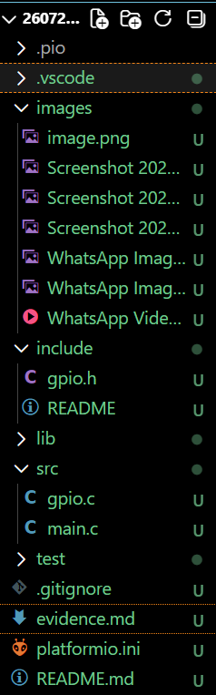

# Evidence

## Build Success


- Successful compilation in PlatformIO showing BUILD SUCCESS.

---

## Upload Success


- Successful firmware upload to the VSDSquadron Mini board.

---

## UART Output


Shows:

```
====================================
VSDSquadron Mini
Firmware Version : 1.0
====================================

Counter : 1
Counter : 2
Counter : 3
```

---

## LED Demonstration

<video controls src="WhatsApp Video 2026-07-21 at 12.44.42 PM.mp4" title="Title"></video>

- LED ON


- LED OFF


---

## Project Structure



Shows:

```
include/
    gpio.h

src/
    gpio.c
    main.c
```

---

# Build success


## Summary

The GPIO library was implemented successfully using reusable APIs.

The application demonstrates:

- GPIO initialization
- LED control using GPIO APIs
- UART communication
- Modular firmware structure

All objectives of Task 2 were completed successfully.