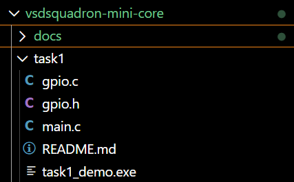
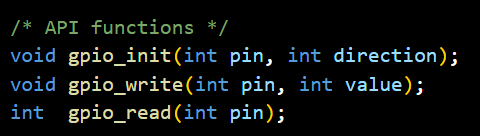
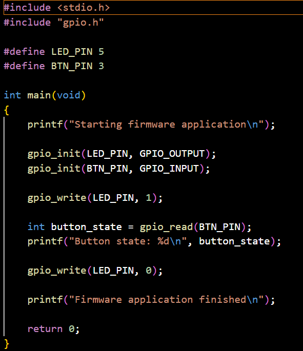
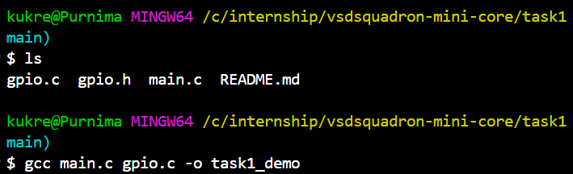

What is a firmware library?
A firmware library is a pre-written collection of code that helps developers easily control hardware components, like sensors and microcontrollers, without having to write low-level instructions from scratch. It acts as a ready-to-use software foundation, translating simple commands (like "turn on LED") into complex hardware actions.
Firmware libraries are used for- code reusability, time saving and hardware abstraction

Why APIs are important in embedded systems?
In embedded systems, APIs are essential because they abstract complex hardware interactions into standardized, reusable functions.this standardization—often found in Hardware Abstraction Layers (HALs)—allows developers to write application software independently of the underlying microcontroller or peripheral details.
This abstraction provides several core benefits:Hardware Portability: -You can swap out physical microcontrollers (e.g., migrating from an 8-bit AVR to a 32-bit ARM) without rewriting your entire application, provided the APIs remain consistent
-Faster Time-to-Market: Engineers can use pre-built API libraries (like the ARM CMSIS or vendor-provided SDKs) to manage I/O pins, timers, and communication protocols (I2C, SPI) instead of reading thousands of pages of processor datasheets to toggle registers manually
-Code Reusability: Standardized APIs allow teams to reuse core logic across different product lines, significantly reducing development time and maintenance costs.

What was understood from the lab code?
From this lab, I understood how firmware is organized into separate files to make the code modular and reusable.

gpio.h contains the API (function declarations) that define how the application can interact with the GPIO library.
gpio.c contains the implementation of those functions. It performs the actual GPIO operations.
main.c acts as the application program. It includes gpio.h and calls the GPIO functions without knowing how they are implemented internally.

This separation of interface (gpio.h) and implementation (gpio.c) is a common design approach in embedded firmware. It makes the code easier to understand, maintain, debug, and reuse in different projects.

Successful compilation

Program output
